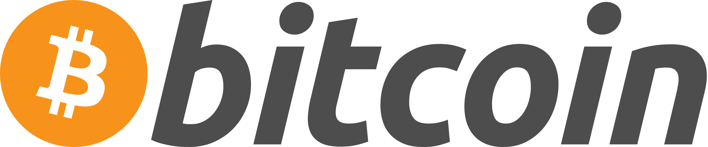

# Blockchain en Python


Este repositorio está basado en un tutorial de Youtube => https://youtu.be/lbwK7kLjm4Y?si=Ti8AIhikKfwxBbG2

Este proyecto implementa una blockchain simple en Python utilizando Flask para la creación de una API web que permita operar sobre ella.

## Ejecución

```bash'
python blockchain.py
```


Una vez ejecutado el programa, se levantará un servidor en `http://localhost:5000/` que permitirá interactuar con la blockchain a través de las siguientes rutas:

## Peticiones disponibles
Archivo para importar las peticiones en Postman: [postmanAPI.json](postmanAPI.json)

### Minar un bloque 
Mina un bloque y devuelve un mensaje de éxito con la información del bloque minado.

`GET /mine_block`
    
```json
    {
        "message": "¡Felicidades, has minado un bloque!",
        "index": 2,
        "timestamp": "2024-05-15 12:34:56.789123",
        "proof": 533,
        "previous_hash": "abc123def456..."
    }
````

### Devolver la cadena de bloques
Devuelve la cadena de bloques completa.

`GET /get_chain`

```json
{
  "chain": [
      {
        "index": 1,
        "timestamp": "2024-05-15 12:34:56.789123",
        "proof": 1,
        "previous_hash": "0"
      },
      {
        "index": 2,
        "timestamp": "2024-05-15 12:36:01.123456",
        "proof": 533,
        "previous_hash": "abc123def456..."
      }
    ],
  "length": 2
}
````

### Validar la cadena de bloques 
Verifica si la cadena de bloques es válida.

`GET /is_valid`

```json
{
  "message": "El blockchain es valido"
}
````

## ¿Que aptitudes he adquirido con este proyecto?:
### Flask
Flask es un microframework de Python que facilita la creación de aplicaciones web. Con este proyecto, aprendí a:


- Crear una API RESTful para interactuar con la blockchain.
- Manejar rutas y métodos HTTP en Flask.
- Ejecutar y probar la aplicación web localmente.

### Clases y Objetos en Python
Este proyecto reforzó mi conocimiento sobre la programación orientada a objetos en Python. Específicamente, aprendí a:


- Definir clases y métodos para representar la estructura y comportamiento de una blockchain.
- Utilizar instancias de clase para gestionar la cadena de bloques y las transacciones.
- Implementar métodos para resolver problemas específicos, como la prueba de trabajo y la validación de la cadena.
### Blockchain
Me ha permitido entender y aplicar los conceptos básicos de blockchain. Con este proyecto, aprendí a:



- Crear y gestionar una cadena de bloques.
- Implementar la prueba de trabajo (Proof of Work) para minar nuevos bloques.
- Verificar la integridad y validez de la cadena de bloques.